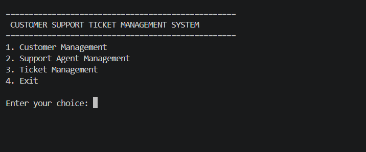
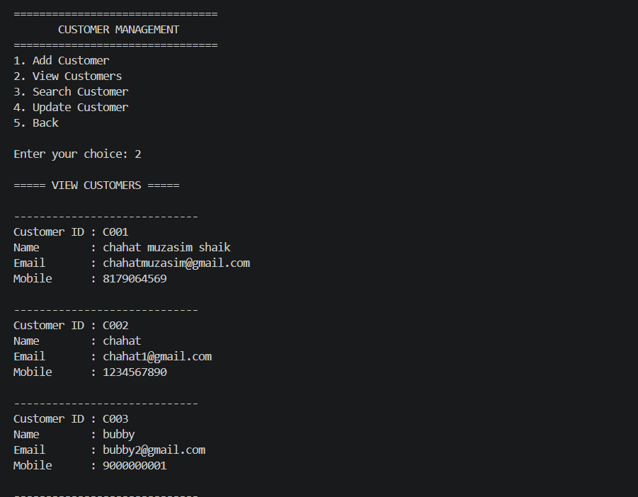
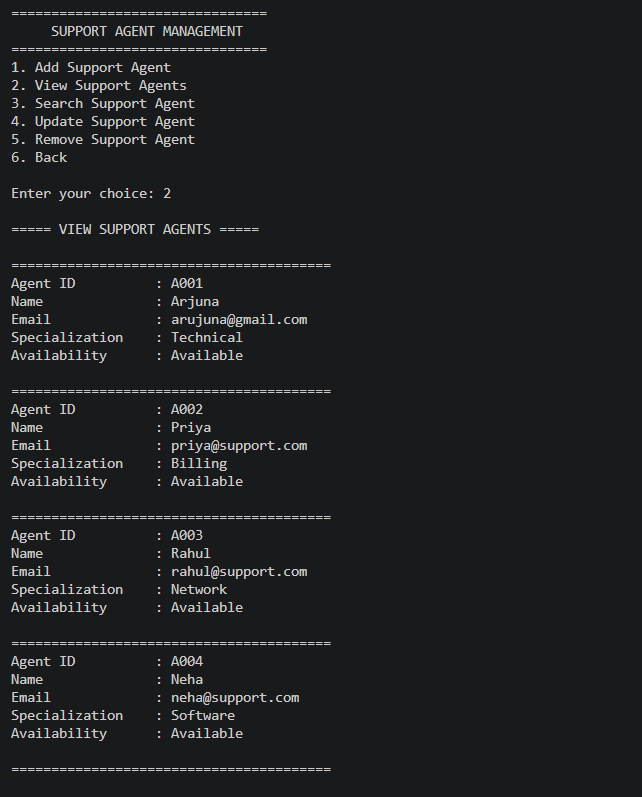
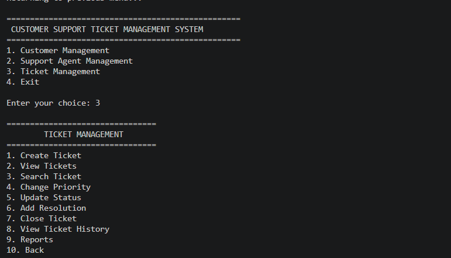
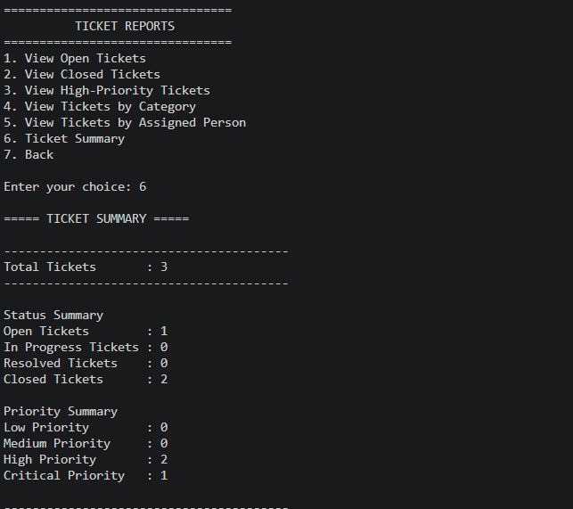
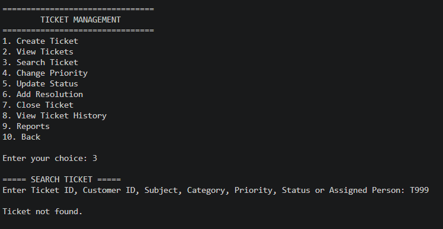
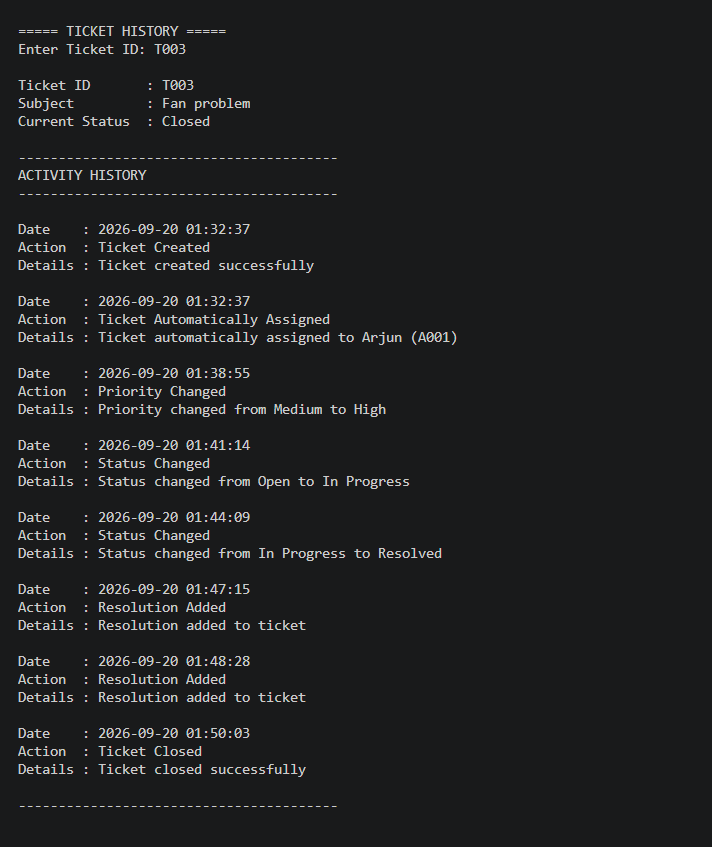

# CUSTOMER SUPPORT TICKET MANAGEMENT SYSTEM

## 1. Project Overview

The **Customer Support Ticket Management System** is a Python-based console application designed to help companies manage customer support requests efficiently.

The system allows users to:

* Manage customer information
* Manage support agents
* Create and manage support tickets
* Automatically assign tickets to suitable support agents
* Track ticket status and priority
* Add resolutions and close tickets
* Maintain ticket history
* Generate useful ticket reports
* Store data permanently using JSON files
* Validate user input and handle errors safely

---

## 2. Problem Statement

Companies receive multiple technical and customer-related support requests every day. Managing these requests manually can make it difficult to track customer information, assign support agents, monitor ticket progress, and maintain resolution records.

This project provides a simple console-based solution to organize customer support operations.

The system helps users:

* Record customer details
* Create support tickets
* Prioritize tickets
* Automatically assign tickets
* Update ticket status
* Record resolutions
* Close completed tickets
* Track ticket history
* Generate support reports
* Maintain data using JSON file storage

---

## 3. Project Objectives

The main objectives of this project are:

1. To develop a Python-based customer support management system.
2. To implement customer and support-agent management.
3. To create and manage support tickets.
4. To automatically assign tickets based on category and agent specialization.
5. To implement ticket priority and status management.
6. To maintain ticket history for tracking changes.
7. To validate user input and prevent invalid data.
8. To implement exception handling for reliable application execution.
9. To store customer, agent, and ticket information using JSON files.
10. To generate useful reports for support management.

---

## 4. Features

### 4.1 Customer Management

The system provides the following customer operations:

* Add Customer
* View Customers
* Search Customer
* Update Customer
* Validate customer name
* Validate email address
* Validate mobile number
* Prevent duplicate email addresses
* Prevent duplicate mobile numbers
* Store customer information in JSON

### 4.2 Support Agent Management

The system provides the following support-agent operations:

* Add Support Agent
* View Support Agents
* Search Support Agent
* Update Support Agent
* Remove Support Agent
* Validate agent details
* Prevent duplicate agent email addresses
* Track agent specialization
* Track agent availability

### 4.3 Ticket Management

The system provides the following ticket operations:

1. Create Ticket
2. View Tickets
3. Search Ticket
4. Change Priority
5. Update Status
6. Add Resolution
7. Close Ticket
8. View Ticket History
9. Generate Reports

Each ticket contains:

* Ticket ID
* Customer ID
* Subject
* Description
* Category
* Priority
* Assigned Person
* Status
* Created Date
* Closed Date
* Resolution
* Comment
* History
* Last Updated Date

### 4.4 Automatic Ticket Assignment

Tickets are automatically assigned to support agents.

The assignment process is:

1. The system checks the ticket category.
2. It searches for an available agent with the matching specialization.
3. If a matching specialist is unavailable, the system selects another available agent.
4. If no agent is available, the ticket remains `"Not Assigned"`.
5. The assignment is recorded in the ticket history.

### 4.5 Ticket Priority

The system supports the following priority levels:

* Low
* Medium
* High
* Critical

### 4.6 Ticket Status

Tickets can have the following statuses:

* Open
* In Progress
* Resolved
* Closed

Closed tickets cannot be modified as active tickets.

### 4.7 Ticket History

The system maintains a history of important ticket activities, including:

* Ticket creation
* Automatic assignment
* Priority changes
* Status changes
* Resolution additions
* Ticket closure

### 4.8 Reports

The system provides reports for:

* Open tickets
* Closed tickets
* High-priority tickets
* Tickets by category
* Tickets assigned to a support person
* Overall ticket summary

The summary includes:

* Total tickets
* Open tickets
* In Progress tickets
* Resolved tickets
* Closed tickets
* Low-priority tickets
* Medium-priority tickets
* High-priority tickets
* Critical-priority tickets

---

## 5. Technologies Used

| Technology | Purpose                      |
| ---------- | ---------------------------- |
| Python     | Application development      |
| JSON       | Data storage and persistence |
| VS Code    | Development environment      |
| Git        | Version control              |
| GitHub     | Repository and collaboration |

---

## 6. Python Concepts Used

This project demonstrates several core Python concepts:

### Variables and Data Types

Used to store customer, agent, and ticket information.

### Conditional Statements

Used for validation and business-rule decisions.

### Loops

Used for searching, displaying, filtering, and processing records.

### Lists and Dictionaries

Used to store and manage collections of customers, agents, and tickets.

### Functions

Used to divide the application into reusable operations.

### Classes and Objects

Used to represent:

* Customer
* Ticket
* Support Agent

### Object-Oriented Programming

The project uses classes, objects, attributes, and methods to organize application data and functionality.

### File Handling

JSON files are used to permanently store application data.

### Exception Handling

`try`, `except`, and related exception-handling mechanisms are used to safely handle file and runtime errors.

### Regular Expressions

Regular expressions are used for validating:

* Email addresses
* Mobile numbers
* Other required input formats

### Date and Time

Python's `datetime` functionality is used to record:

* Ticket creation date
* Last updated date
* Ticket closing date
* History timestamps

---

## 7. Project Structure

```text
Customer_support_ticket_managment_system/
│
├── main.py
├── README.md
├── .gitignore
│
├── data/
│   ├── agents.json
│   ├── customers.json
│   ├── support_agents.json
│   └── tickets.json
│
├── modules/
│   ├── __init__.py
│   ├── customer.py
│   ├── ticket.py
│   └── support_agent.py
│
└── tests/
    └── test_cases.md
```

### File Description

**main.py**

Contains the main application logic, menus, validations, ticket operations, reports, file handling, and integration of all modules.

**modules/customer.py**

Contains the `Customer` class and customer-related object methods.

**modules/ticket.py**

Contains the `Ticket` class and ticket-related object methods.

**modules/support_agent.py**

Contains the `SupportAgent` class and support-agent-related object methods.

**data/customers.json**

Stores customer information.

**data/support_agents.json**

Stores support-agent information.

**data/tickets.json**

Stores ticket information.

**tests/test_cases.md**

Contains the project's testing scenarios and test results.

**README.md**

Contains project documentation, features, design, implementation details, testing information, and usage instructions.

**.gitignore**

Prevents unnecessary files such as Python cache files, virtual environments, and local VS Code settings from being committed.

---

## 8. Module Description

### Customer Module

The Customer module contains the `Customer` class.

#### Attributes

* Customer ID
* Name
* Email
* Mobile

#### Methods

* `to_dict()`
* `update_details()`

The module is responsible for representing and updating customer information.

### Ticket Module

The Ticket module contains the `Ticket` class.

#### Attributes

* Ticket ID
* Customer ID
* Subject
* Description
* Category
* Priority
* Assigned Person
* Status
* Created Date
* Closed Date
* Resolution
* Comment
* History
* Last Updated

#### Methods

* `to_dict()`
* `is_closed()`

The module represents ticket information and provides functionality to check whether a ticket is closed.

### Support Agent Module

The Support Agent module contains the `SupportAgent` class.

#### Attributes

* Agent ID
* Name
* Email
* Specialization
* Availability

#### Methods

* `to_dict()`
* `update_details()`

The module represents support-agent information.

---

## 9. Data Persistence

The application uses JSON files for permanent data storage.

The following files are used:

```text
data/customers.json
data/support_agents.json
data/tickets.json
```

The system:

1. Loads existing data when the application starts.
2. Allows users to modify the data.
3. Saves updated information back to JSON files.
4. Loads the saved information again when the application is restarted.

This allows customer, agent, and ticket information to persist between application sessions.

---

## 10. Ticket Workflow

The ticket workflow follows these steps:

```text
Customer
   ↓
Create Ticket
   ↓
Validate Customer ID
   ↓
Validate Ticket Information
   ↓
Automatic Ticket Assignment
   ↓
Ticket Created
   ↓
Update Priority / Status
   ↓
Add Resolution
   ↓
Close Ticket
   ↓
Store Closing Date
   ↓
Update Ticket History
```

### Ticket Creation

When a ticket is created, the system:

1. Validates the ticket ID.
2. Checks whether the ticket ID is unique.
3. Checks whether the customer exists.
4. Collects subject and description.
5. Validates the ticket category.
6. Sets the ticket priority.
7. Automatically assigns a support agent.
8. Sets the initial status to `Open`.
9. Records the creation date.
10. Adds the creation event to ticket history.
11. Saves the ticket to the JSON file.

### Ticket Closure

Before closing a ticket:

1. The ticket must exist.
2. The ticket must not already be closed.
3. A resolution must be available.
4. The status is changed to `Closed`.
5. The closing date is recorded.
6. The ticket history is updated.
7. The updated ticket is saved.

---

## 11. Automatic Assignment Logic

The automatic assignment system matches tickets with support agents.

### Assignment Rules

```text
Ticket Category
      ↓
Find Available Agent
      ↓
Matching Specialization?
     / \
   Yes  No
   ↓     ↓
Assign  Find Any
        Available Agent
             ↓
       Agent Available?
          /       \
        Yes        No
         ↓         ↓
      Assign   Not Assigned
```

For example:

```text
Ticket Category: Network
Agent Specialization: Network
Agent Availability: Available

Result:
Ticket automatically assigned to the Network specialist.
```

The assignment is also stored in the ticket history.

---

## 12. Validation and Exception Handling

The application contains input validation and exception handling to improve reliability.

### Customer Validation

The system validates:

* Customer ID
* Customer name
* Email address
* Mobile number
* Duplicate email
* Duplicate mobile number

### Support Agent Validation

The system validates:

* Agent ID
* Agent name
* Email address
* Specialization
* Availability
* Duplicate email

### Ticket Validation

The system validates:

* Ticket ID
* Customer ID
* Subject
* Description
* Category
* Priority
* Status

### File Exception Handling

The system handles common file-related errors such as:

* File not found
* Invalid JSON data
* File access errors
* Operating system errors

### Invalid Input Handling

The application prevents invalid menu selections and invalid IDs from terminating the program unexpectedly.

---

## 13. Business Rules

The system follows the following business rules:

1. Ticket IDs must be unique.
2. A ticket must belong to an existing customer.
3. Tickets must have a valid priority.
4. Tickets must have a predefined status.
5. Closed tickets cannot be modified as active tickets.
6. A resolution should be recorded before closing a ticket.
7. Customer email addresses must be unique.
8. Customer mobile numbers must be unique.
9. Support-agent email addresses must be unique.
10. Tickets are automatically assigned based on agent specialization and availability.
11. Important ticket activities are recorded in ticket history.
12. Ticket data is stored persistently in JSON files.

---

## 14. Reports

The Reports section provides useful information about the current support workload.

### Available Reports

#### Open Tickets

Displays tickets that are currently open.

#### Closed Tickets

Displays tickets that have been completed and closed.

#### High-Priority Tickets

Displays tickets with high priority.

#### Tickets by Category

Groups tickets according to their category.

#### Tickets by Assigned Person

Displays tickets assigned to each support agent.

#### Ticket Summary

Displays overall ticket statistics.

Example:

```text
Total Tickets       : 3
Open Tickets        : 1
In Progress Tickets : 0
Resolved Tickets    : 0
Closed Tickets      : 2
Low Priority        : 0
Medium Priority     : 0
High Priority       : 2
Critical Priority   : 1
```

---

## 15. How to Run the Project

### Step 1: Clone the Repository

```bash
git clone https://github.com/Chahatmuzasim035/Customer_support_ticket_managment_system.git
```

### Step 2: Open the Project

Open the project folder in Visual Studio Code.

### Step 3: Open the Terminal

In VS Code:

```text
Terminal → New Terminal
```

### Step 4: Run the Application

Use:

```bash
python main.py
```

### Step 5: Use the Main Menu

The application displays:

```text
========================================
 CUSTOMER SUPPORT TICKET MANAGEMENT SYSTEM
========================================

1. Customer Management
2. Support Agent Management
3. Ticket Management
4. Exit
```

Select the required option by entering the corresponding number.

---

## 16. Testing

The project was tested using valid, invalid, and boundary inputs.

### Customer Management Testing

Tested:

* Add customer
* View customer
* Search customer
* Update customer
* Invalid customer ID
* Invalid email
* Invalid mobile number
* Duplicate email
* Duplicate mobile
* Data persistence

### Support Agent Management Testing

Tested:

* Add support agent
* View support agents
* Search support agent
* Update support agent
* Remove support agent
* Invalid agent ID
* Invalid email
* Duplicate email
* Data persistence

### Ticket Management Testing

Tested:

* Create ticket
* View tickets
* Search ticket
* Automatic ticket assignment
* Change priority
* Update status
* Add resolution
* Close ticket
* View ticket history
* Invalid ticket ID
* Closed-ticket restrictions
* Data persistence

### Reports Testing

Tested:

* Open tickets report
* Closed tickets report
* High-priority tickets report
* Category report
* Assigned-person report
* Ticket summary report

### Integration Testing

All three team modules were integrated and tested together.

The final integrated application successfully verified:

* Customer Management
* Support Agent Management
* Ticket Management
* Automatic ticket assignment
* Ticket reports
* Ticket history
* JSON persistence
* Application restart
* Menu navigation
* Input validation
* Exception handling

### Final Test Result

```text
Customer Management       : PASS
Support Agent Management  : PASS
Ticket Management         : PASS
Automatic Assignment      : PASS
Ticket History            : PASS
Reports                   : PASS
Validation                : PASS
Exception Handling        : PASS
File Persistence          : PASS
Application Restart       : PASS
Navigation                : PASS
```

---

## 17. Sample Error Handling

The application displays appropriate messages for invalid operations.

Examples:

```text
Invalid customer ID.
```

```text
Customer with this email already exists.
```

```text
Customer with this mobile number already exists.
```

```text
Invalid ticket ID.
```

```text
Ticket is already closed.
```

```text
Resolution is required before closing the ticket.
```

```text
Invalid priority.
```

```text
Invalid status.
```

```text
Invalid menu choice.
```

These validations prevent incorrect data from being stored.

---

## 18. Future Enhancements

The current application is a console-based Python system. Possible future enhancements include:

* Graphical user interface
* Web-based interface
* Database integration
* User authentication
* Role-based access control
* Email notifications
* Advanced analytics
* Ticket search filters
* Agent workload balancing
* Ticket escalation
* Service-level agreement tracking
* Export reports to CSV or PDF
* Cloud-based deployment

---

## 19. Conclusion

The **Customer Support Ticket Management System** successfully provides a structured way to manage customers, support agents, and support tickets.

The project demonstrates practical use of Python programming concepts including:

* Object-Oriented Programming
* Functions
* Lists and dictionaries
* File handling
* JSON persistence
* Regular expressions
* Date and time handling
* Exception handling
* Input validation
* Business logic

The automatic ticket assignment feature helps connect tickets with available support agents based on specialization and availability.

The project also maintains ticket history and provides reports that help users monitor ticket activity.

Overall, the application demonstrates how Python can be used to develop a complete console-based management system with persistent data, validation, exception handling, and modular design.

---

## 20. Project Status

### Development Status

```text
Project Status: COMPLETED
```

### Completed Components


- Customer Management
- Support Agent Management
- Ticket Management
- Automatic Ticket Assignment
- Ticket Priority Management
- Ticket Status Management
- Ticket Resolution
- Ticket Closure
- Ticket History
- Reports
- Input Validation
- Exception Handling
- JSON File Persistence
- Integration Testing
- GitHub Version Control
- Project Documentation

### Final Application

The application was tested after integrating all team members' modules and successfully completed the required functionality and testing scenarios.

---

## 21. Screenshots

### 1. Main Menu



### 2. Customer Management



### 3. Support Agent Management



### 4. Ticket Management



### 5. Ticket Reports



### 6. Validation



### 7. Ticket History



---

## Team Members

* **Shaik Chahat Muzasim** — Team Lead — Core Ticket Management, Integration & Final Testing
* **Neelufar** — Customer Management & Customer Validation
* **Nikitha** — Support Agent Management & Agent Validation

---

## Repository

**GitHub Repository:**
## Repository

[GitHub Repository](https://github.com/Chahatmuzasim035/Customer_support_ticket_managment_system)

---

**CUSTOMER SUPPORT TICKET MANAGEMENT SYSTEM**
*Python Console-Based Application*
